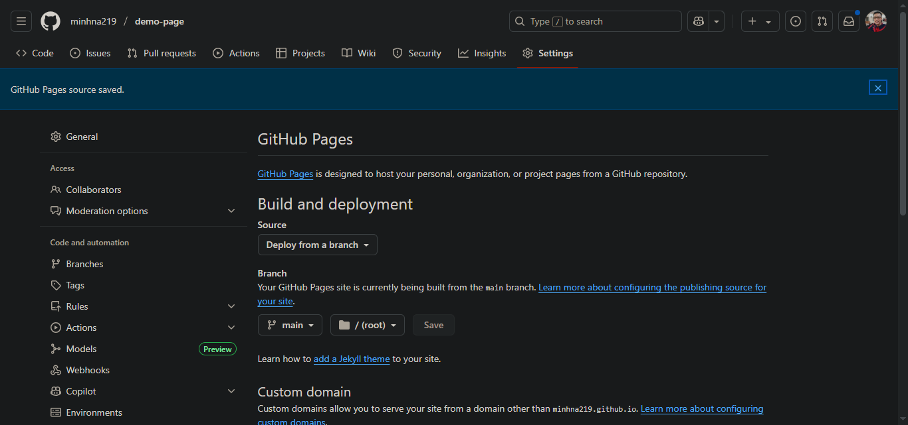
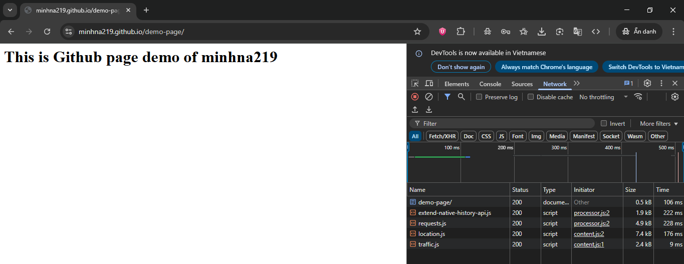

# Github Pages

[GitHub Pages](https://pages.github.com/) is designed to host your personal, organization, or project pages from a GitHub repository.

## 1. Lưu ý

- Repo phải public

## 2. Steps

Dùng GitHub Pages để host web tĩnh theo 1 trong 2 cách sau

### 2.1. Cách 1 (Recommended): Project site

Vào link [này](https://pages.github.com/) rồi click chọn: Project site > Start from scratch

Sau đó làm theo hướng dẫn

--> Vào: **Settings** > **Pages** > **Dưới phần Branch**, rồi chọn `main`. Cuối cùng là ấn **Save**

<div align="left">
  
</div>

--> Sau đó truy cập URL:
```
https://minhna219.github.io/demo-page/
```

<div align="left">
  
</div>

### 2.2. Cách 2: User or organization site

Vào link [này](https://pages.github.com/) rồi click chọn: User or organization site

Sau đó làm theo hướng dẫn

## 3. References

> https://docs.github.com/en/pages/getting-started-with-github-pages/creating-a-github-pages-site
> 
> https://viblo.asia/p/tao-trang-web-voi-github-pages-obA46v1G4Kv
> 
> https://www.youtube.com/watch?v=e5AwNU3Y2es
> 
> https://www.youtube.com/watch?v=o5g-lUuFgpg
> 
> https://www.youtube.com/watch?app=desktop&v=nAXfd184JqE
> 
> https://www.youtube.com/watch?v=OltY8JIaP-4
> 
> https://www.youtube.com/watch?app=desktop&v=JdK-tYs3G8Y 
