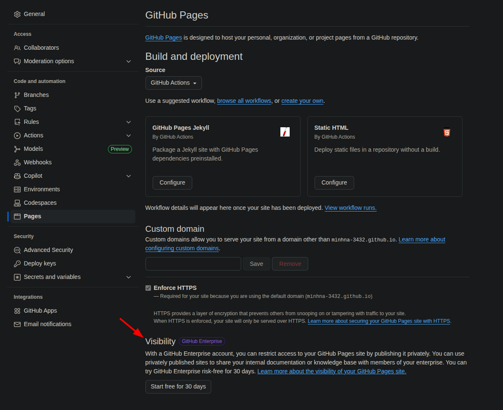
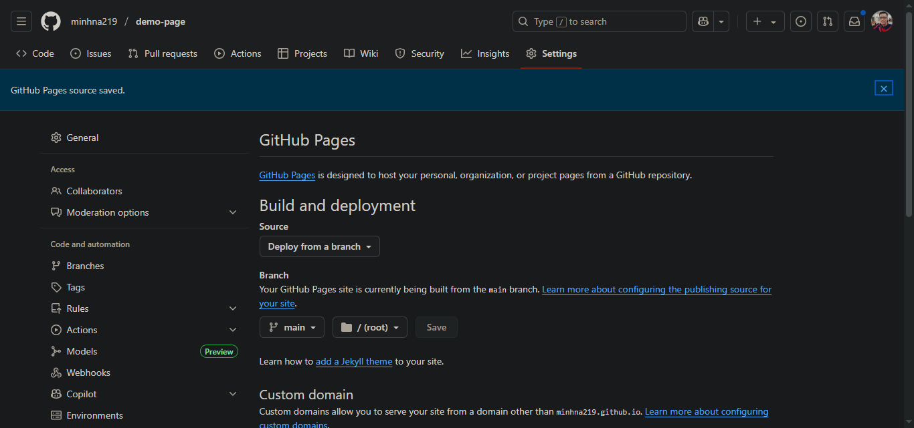
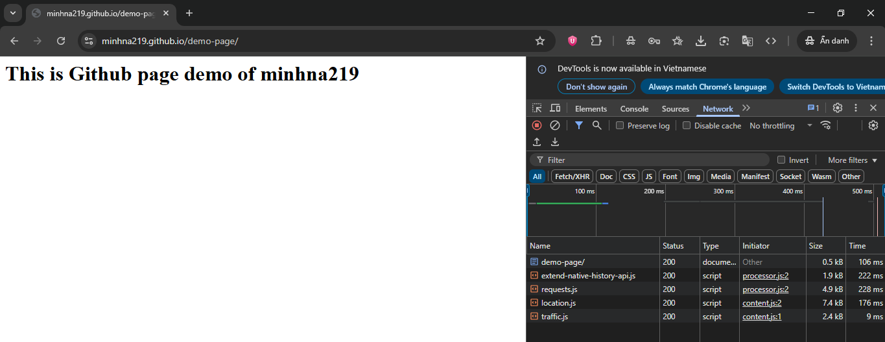
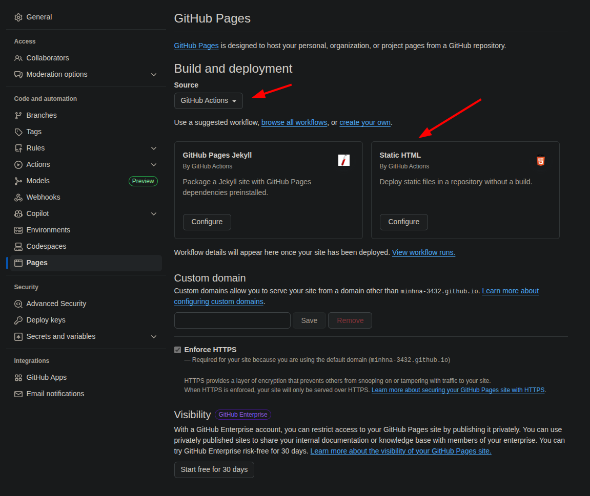
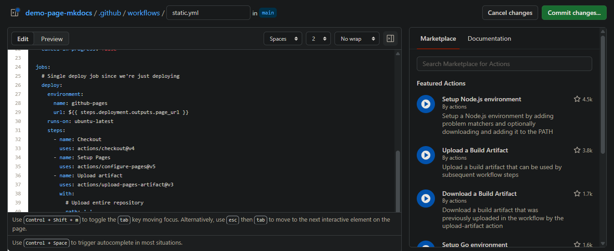
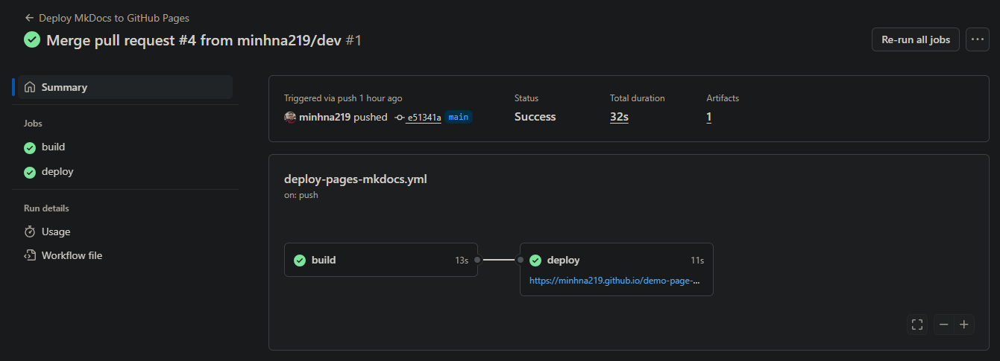

# Github Pages

[GitHub Pages](https://pages.github.com/) is designed to host your personal, organization, or project pages from a GitHub repository.

## 1. General

Có 2 loại Github Pages là:
- `Deploy from a branch`: Deploy chính xác từ code của 1 nhánh, thường dùng với các Webiste tĩnh chạy HTML, CSS và JavaScript, ... thông thường
- `Github Actions`: Deploy phần output từ code của 1 nhánh, thường dùng với các Webiste tĩnh chạy ReactJS, VueJS và NextJS, ... Cách này sẽ giúp người dùng giữ source code trên nhánh, và chỉ đẩy file đã build lên Webiste

## 2. Visibility

Bình thường thì repo phải public thì mới có thể cấu hình Github Pages, và Website sẽ public đối với tất cả mọi người

Tuy nhiên, có thể giới hạn access cho Github Pages, giúp cho Website chỉ có thể truy cập từ 1 số Github user nhất định, nhưng tính năng này là dành cho Github enterprise

<div align="left">
  
</div>

## 3. Steps đối với source là `Deploy from a branch`

Dùng GitHub Pages để host web tĩnh theo 1 trong 2 cách sau

### 3.1. Cách 1 (Recommended): Project site

Vào link [này](https://pages.github.com/) rồi click chọn: Project site > Start from scratch

Sau đó làm theo hướng dẫn

--> Vào: **Settings** > **Pages** > **Dưới phần Branch**, rồi chọn `main`. Cuối cùng là ấn **Save**

<div align="left">
  
</div>

--> Sau đó truy cập URL:
```
https://minhna219.github.io/demo-page/
```

<div align="left">
  
</div>

### 3.2. Cách 2: User or organization site

Vào link [này](https://pages.github.com/) rồi click chọn: User or organization site

Sau đó làm theo hướng dẫn

## 4. Steps đối với source là `Github Actions`

Chọn như hình dưới và chọn 1 workflow phù hợp

<div align="left">
  
</div>

--> Nếu Github Pages dùng Mkdocs thì sẽ dùng file [này](https://github.com/minhna219/demo-page-mkdocs/blob/main/.github/workflows/deploy-pages-mkdocs.yml) cho Github Actions bằng cách thay thế vào code trong hình dưới
<div align="left">
  
</div>

--> Có push lên nhánh `master` thì sẽ tự động chạy Github Actions và deploy lên Github Pages
<div align="left">
  
</div>

--> Xong quay trở lại màn cấu hình Github Pages thì sẽ thấy URL là:
```
https://minhna219.github.io/demo-page-mkdocs/
```

## 4. References

> https://docs.github.com/en/pages/getting-started-with-github-pages/creating-a-github-pages-site
> 
> https://viblo.asia/p/tao-trang-web-voi-github-pages-obA46v1G4Kv
> 
> https://www.youtube.com/watch?v=e5AwNU3Y2es
> 
> https://www.youtube.com/watch?v=o5g-lUuFgpg
> 
> https://www.youtube.com/watch?app=desktop&v=nAXfd184JqE
> 
> https://www.youtube.com/watch?v=OltY8JIaP-4
> 
> https://www.youtube.com/watch?app=desktop&v=JdK-tYs3G8Y 
